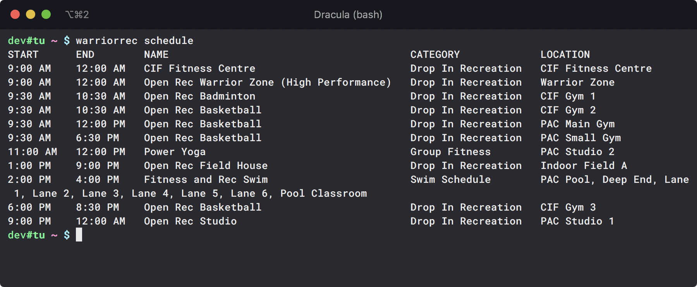

# warriorrec

_A library and CLI tool for getting [Warrior Recreation](https://warrior.uwaterloo.ca) schedules._

<p align="center">
  
</p>

## Installation

See the [releases](https://github.com/stevenxie/warriorrec/releases) section
to install binaries to your `$PATH` manually.

Alternatively, install with [Homebrew](https://brew.sh):

```bash
brew install stevenxie/tap/warriorrec
```
